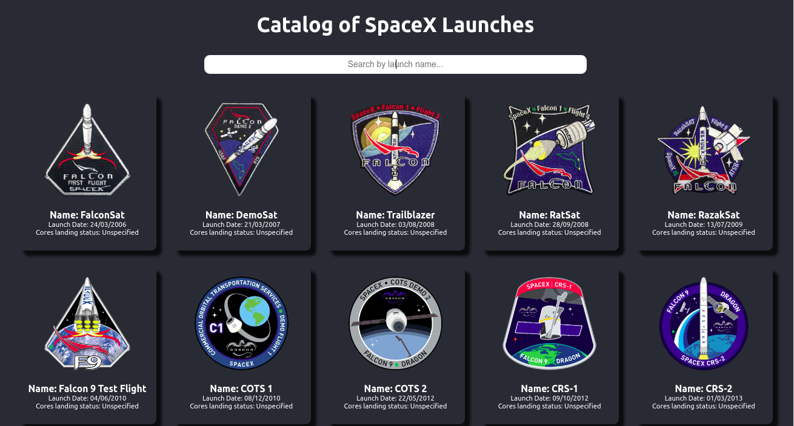

# Smartia Frontend Developer Challenge

This repository contains my implementation of the Smartia frontend challenge.

## Built With

- CSS BEM structure
- npm & ES6
- React (React-Create-App)
- 

## [Live Demo here](https://f-end-test.netlify.app/)

## Setup

To get a local copy up and running follow these simple example steps.

- On the project GitHub page, navigate to the main page of the repository [this page](https://github.com/teekaytech/frontend-dev-test.git).
- Under the repository name, locate and click on a green button named `Code`.
- Copy the project URL as displayed.
- If you're running Windows Operating System, open your command prompt. On Linux, Open your terminal.
- Change the current working directory to the location where you want the cloned directory to be made. Leave as it is if the current location is where you want the project to be.
- Type `git clone`, and then paste the URL you copied in Step 3. 
  `$ git clone https://github.com/teekaytech/frontend-dev-test.git` <em>Press Enter key</em> 
- Press Enter. Your local copy will be created.

Please Note that you must have github installed on your PC, this can be done

## Making Changes / Running the app locally

- `yarn install` or `npm install` to install the dependencies and packages
- `yarn start` to test the app before or after changes were made

## Prerequisites

- [Git](https://gist.github.com/derhuerst/1b15ff4652a867391f03).
- Web browser (Chrome/Firefox)
- [Node](https://nodejs.org/en/)
- [NPM](https://www.npmjs.com/get-npm)

### Usage

Alernately, you can click on the live demo link and peruse the app.

## My Task

### Description

Having taken a keen interest in SpaceX launches recently :rocket:, you've discovered a [public API](https://github.com/r-spacex/SpaceX-API) where you can query for launch, rocket, launchpad, landing pad data and more.

- [SpaceX API README](https://github.com/r-spacex/SpaceX-API/blob/master/docs/v4/README.md)
- Example: [Past launches](https://api.spacexdata.com/v4/launches/past)

The API is REST and does not require any authenitcation.

> `past_launches.json` is provided at the root of this repository as a static example of the data

Armed with your newly discovered API you've tasked yourself with writing a simple application to **list and query past launches**.

### The Requirements

You've decided the application _must have_ the following features:

- List of past SpaceX launches displaying:
  - Flight patch image (`links.patch.small`)
  - Name (`name`)
  - Launch date (`date_utc` or `date_local`)
  - Whether all the cores successfully landed (`cores.landing_success`)
- Search allowing you to query for:
  - Launch name (`name`)

### The Fun Part

#### The UX

This is :100: percent in your control!

Feel free to put as much energy into the UX as you are comfortable. If UX and a sleak design is where you feel you shine, feel free to focus here (as long as the application basically works of course).

Don't worry if UX isn't your thing, it's :100:% fine to use an off the shelf library or maybe even go for a super minimalistic look using plain HTML.

> Note! Don't worry about responsiveness or mobile screens for this exercise.

#### The Code

We have provide you with a base template in a Create React App to get you started.

From this point onwards the codebase is :100:% in your control to take it in any direction you wish to complete the task.

This could include:

- Installing any library of your choice to help you complete the task
- Changing the directory structure
- Add TypeScript support (if you're more comfortable with TS)
- ...

> Tip! Consider that others might work on this application in the future.

## My Implementation Summary
I forked the given repository, cloned to my local PC and created 2 more branches: the development branch and the working/feature branch.

I created components as deemed necessary, fetch from the API as requested and style my components using CSS BEM structure. I fixed likely bugs and deployed the app on Netlify.

Finally, I created a pull request from my feature branch to my development branch. In summary, it took me almost 3hours, but the project was fun to build.
## Author

👤 **Taofeek Olalere**

- Github: [@teekaytech](https://github.com/teekaytech)
- Twitter: [@ola_lere](https://twitter.com/ola_lere)
- Linkedin: [olaleretaofeek](https://linkedin.com/in/olaleretaofeek)
- Portfolio: [Olalere Taofeek](https://teekaytech.github.io/olaleretaofeek/)

## 🤝 Contributing

Contributions, issues and feature requests are welcome!

## Show your support

Give a ⭐️ if you like this project!

## Acknowledgments

- [Microverse linters config](https://.microverse.org/)
- [create-react-app boilerplate from Facebook team](https://github.com/facebook/create-react-app)
- [Netlify](https://app.netlify.com/)
- [Smartia frontend test repo](https://github.com/smartia-tech/frontend-dev-test)
- [rspaceX API doc](https://github.com/r-spacex/SpaceX-API/blob/master/docs/v4/README.md)
